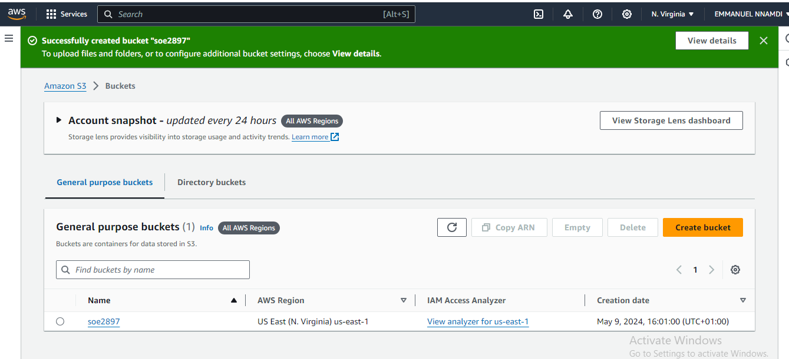
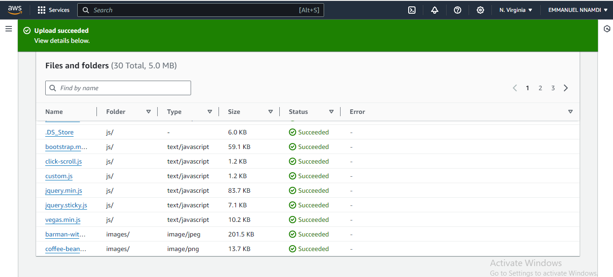
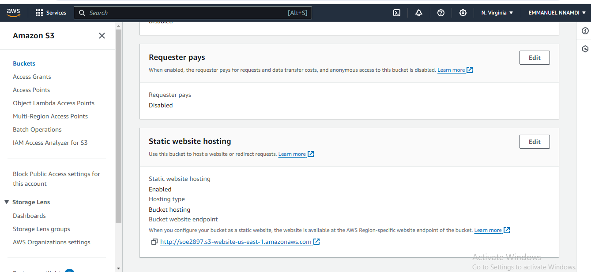
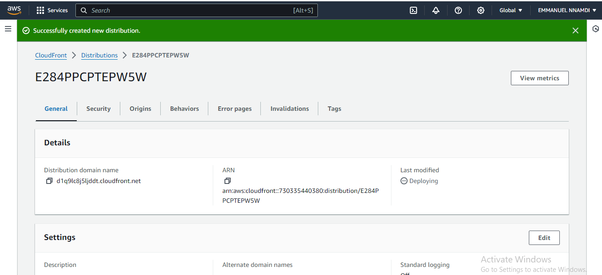
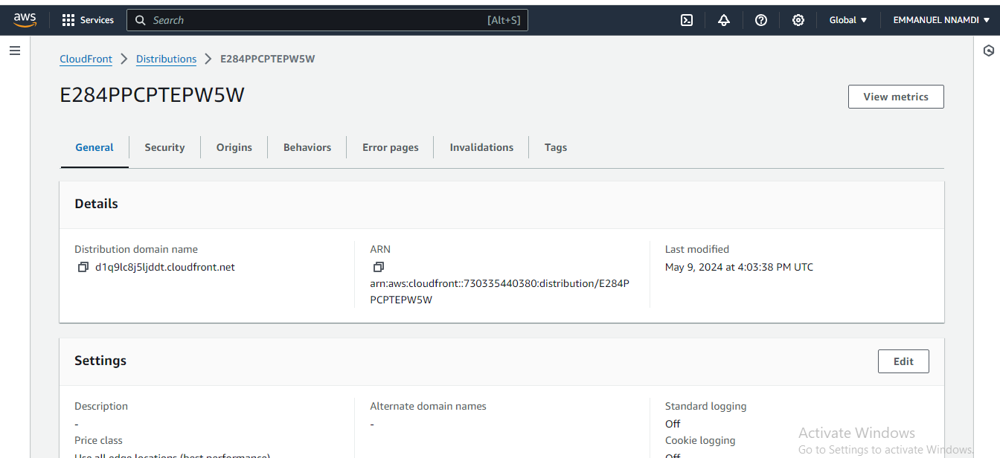
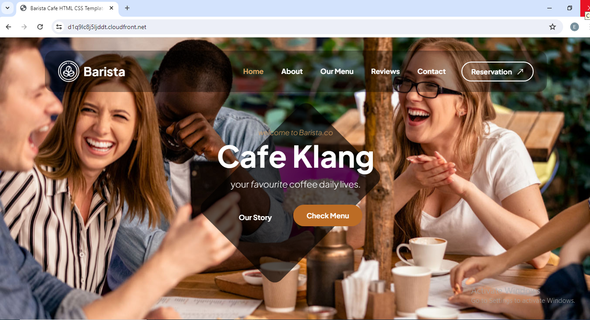

# CLOUD ENGINEERING SEMESTER 3 ASSIGNMENT 1

Objective:

## create a static website and host it on S3 bucket(private bucket) but with public read policy assigned, using cloud front for CDN.

```bash
Login to your AWS console if you have a AWS account or create one if you dont and login. 
```

# Creating a Bucket on Amazon S3

On the AWS console click on services and navigate to S3 dashboard. 


1. Click on create a Bucket button to create a new S3 bucket. Our S3 bucket will be named soe2897.

1. Uncheck Block all public access dialouge box.

1. check the Acknowledgement dialouge box.

1. leave other default settings and click on the Create bucket button at the bottom of the page. 

<br>
---



---
<br>
# Upload Website files to S3 Bucket


We have successfuly created oue S3 bucket. We now upload our webpages/webfiles to our S3 bucket.
On the File Upload page, we click on the Add files button to add a file from your computer, or Add folder button to add multiple files from a folder.

After uploading our files, we will Leave all other settings intact, scroll to the bottom of the page and click on the Upload button to start the uploading of the files we have added.
<br>
---



---
<br>
```bash
click on the Close button to return to the Bucket dashboard
```

# Configure our S3 bucket to host our webpages


1. On the Bucket dashboard, click on the Properties tab and scroll down to Static website hosting. click edit button there.

1. Select the Enable radio box under Static website hosting

1. on the index document, type in the name of your index document. mine is index.html

1. Enter the Error document that will be shown when an error occurs. mine is Errorr404.html

1. Scroll to the bottom of the page and click on the Save changes button.


# Add a Bucket Policy

On the Bucket dashboard, click on the Permissions tab and scroll down to Bucket policy then click Edit button.


Copy the following bucket public read policy, and paste it in the Bucket policy editor;

```bash

{
    "Version": "2012-10-17",
    "Statement": [
        {
            "Sid": "PublicReadGetObject",
            "Effect": "Allow",
            "Principal": "*",
            "Action": "s3:GetObject",
            "Resource": "arn:aws:s3:::soe2897/*"
        }
    ]
}

```

```bash
Click on the Save changes button

```

Our website is ready and good to go live.

we now copy our website bucket endpoint;

```bash
http://soe2897.s3-website-us-east-1.amazonaws.com

```
<br>
---



---
<br>
# Creating a CloudFront Distribution

Click on services and navigate to CloudFront dashboard. 

Amazon CloudFront is a fast content delivery network (CDN) service that securely delivers data, videos, applications, and APIs to customers globally with low latency and high transfer speeds. We need cloudfront to enable accelerated, reliable and secure content delivery for our S3 bucket.


click on the Create distribution button

under Origin domain, enter our website bucket endpoint

```bash
http://soe2897.s3-website-us-east-1.amazonaws.com

```

1. Enter index.html for Default root object

1. Enable WAF firewall service if you want to nut since this is a demo process we will choose no firewalls.

1. since we do not have a custom domain name for our website we will leave other settings to the default values/

1. Scroll to the bottom and click on the Create distribution button


Cloudfrond distribution created successfully. 
<br>
---



---
<br>
Below is our distribution domain name;

```bash
https://d1q9lc8j5ljddt.cloudfront.net

```
<br>
---



---
<br>
# Confirm our website is live

We now place our domain name on a browser to confirm our website is live.

As you can see from the image below our website is live

<br>
---



---
<br>

